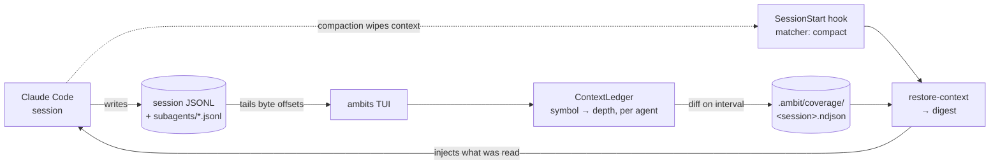
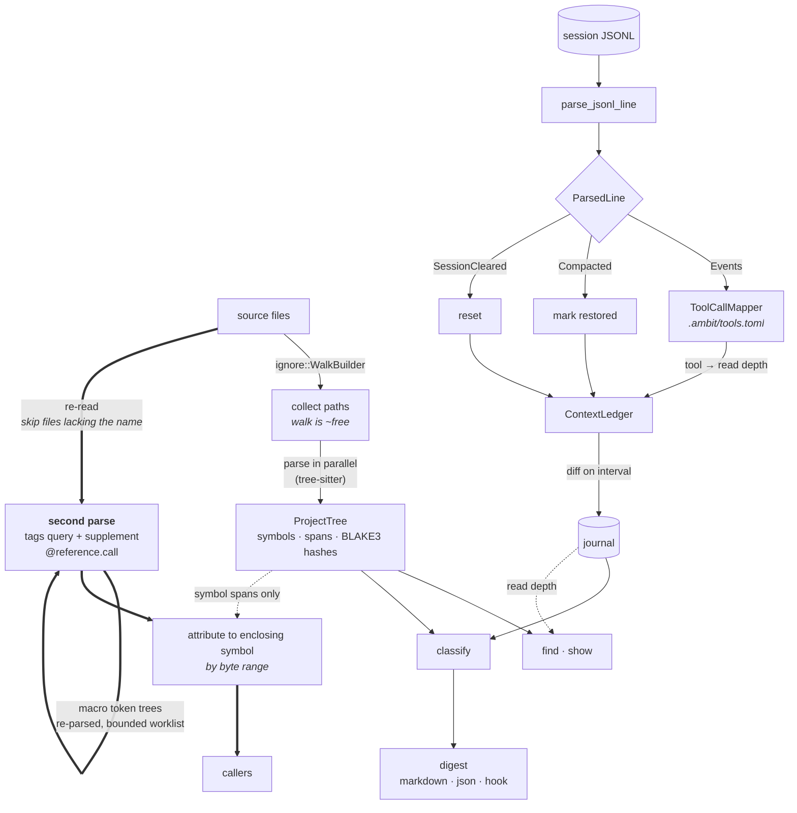

# Ambits

[](https://github.com/joshLong145/ambits/actions/workflows/ci.yml)
[](https://codecov.io/gh/joshLong145/ambits)

**A code-reading tool for AI agents, and a memory of what they have read.**

Coding agents read whole files to find one function, re-read code they already know, and lose all of it the moment the context window compacts. ambits addresses both halves of that:

- **Reading** — `ambits show` returns a symbol's definition as structured JSON, addressed by name or by content hash. The agent asks for `App/process_compaction`, not for 2,000 lines of `app.rs`.
- **Remembering** — ambits records every symbol the agent reads, at what depth, throughout the session. After a compaction it can hand that history back, so the agent knows what it already understands instead of rediscovering it.

Both surfaces are plain text and JSON with no vendor coupling, so the record can be handed between agents, or between providers. Ingestion is currently built and tested against Claude Code.

There is also a live TUI, for when you want to watch what your agent is actually looking at.


## Quick start

```bash
cargo install ambits

# Read a symbol instead of a file
ambits -p . show 'src/app.rs::App/process_compaction'

# What has this session read so far?
ambits -p . restore-context

# Hand that history back automatically after every compaction
ambits hook install --project .

# Watch it live
ambits -p .
```

---

# For the agent

## Searching code

`find` is a grep whose every hit knows which symbol it landed in.

```bash
ambits -p . find 'is_binary'                 # every use and definition
ambits -p . find 'fn enclosing' -t rust      # one file type
ambits -p . find 'TODO' -g '!tests/**'       # globs; ! excludes
ambits -p . find 'Journal::open' -A 3        # with trailing context
ambits -p . find 'unwrap\(\)' -c             # matching lines per file
```

```
src/find.rs:67:7:[full BINARY_SNIFF_BYTES] const BINARY_SNIFF_BYTES: usize = 8 * 1024;
src/find.rs:337:4:[full is_binary] fn is_binary(buf: &[u8]) -> bool {
src/find.rs:338:21:[full is_binary]     buf.iter().take(BINARY_SNIFF_BYTES).any(|&b| b == 0)
src/find.rs:442:8:[full search_file]     if is_binary(&buf) || !matcher.worth_searching(&buf) {
```

`file:line:column:` — the prefix every grep consumer already parses — then the
symbol the match sits in and how deeply this session has read it, then the line.
`--no-symbol` drops that field for output byte-identical to ripgrep's.

The flags **are** ripgrep's, down to the regex engine: `-i -w -x -F -v -U -e -g
-t -A -B -C -n -N -o -l -c -m -M -q --hidden --no-ignore --heading --color
--json`. That is not imitation for its own sake — Claude Code's `Grep` tool is
ripgrep-backed, so an agent reaching for this already knows the dialect, and the
same `regex` crate means patterns behave identically, including the shared
absence of backreferences and lookaround.

### What the symbol column is for

| Form | Meaning |
|---|---|
| `[full name]`, `[signature name]`, … | This session has read the symbol, at that depth |
| `[— name]` | It has not |
| `[name]` | No coverage journal: *unknown*, which is not the same as unread |
| `[-]` | The match is not inside any symbol — a `use` line, or a file no parser handles |

The third row is the one that matters. An empty column would read as "unread"
when the honest answer is "nobody was watching", and only one of those means go
read it. In `--json`, a `coverage` object on the summary event is what
distinguishes them.

Every text file is searched, not only the parseable ones — a hit in a TOML file
is a real hit, it simply has no symbol.

### Searching is reading

A search prints source into an agent's context, so it records what it showed:
every symbol whose matching line was printed is journaled as read, at the hash
it was searched at. Modes that print no source — `-q`, `-l`, `-c` — record
nothing, and neither do matches cut past `--head-limit`. The journal is a record
of what was *seen*, not of what the process computed.

### Deviations from ripgrep, all four deliberate

Output is always sorted by path, line and column, because determinism is worth
more to an agent than the microseconds. `--head-limit` caps at 200 matches and
`-M` clips lines at 300 columns, because this output lands in a context window
rather than a terminal; `0` lifts either. `--column` is on by default, because
it is what disambiguates two matches on one line. Exit codes are grep's: `0`
matched, `1` nothing matched, `2` error.

### The pipeline runs backwards

Every other command scans the project first: walk, parse every file, then
answer. A search inverts that — walk, read, reject on the raw bytes, and parse
only the survivors. Searching this repo for `classify` reads 61 files and parses
the 5 that matched, in about 0.01s; a pattern that matches nothing parses
nothing and costs 0.00s, where the old symbol-index `find` paid for a full parse
every time.

## Finding callers

```bash
ambits -p . callers centered_rect
```

```
centered_rect — 2 call sites in 2 callers
  src/ui/alignment.rs::render  (src/ui/alignment.rs:16)
  src/ui/compaction.rs::render  (src/ui/compaction.rs:15)
```

Call sites come from the grammar's own tags query, so a mention in a comment or
inside a string literal is never reported — the answer is a call node or it is
not there. Each site is attributed to the innermost symbol containing it, and
that id goes straight into `show`.

**Matching is by name, not by resolution.** tree-sitter parses; it does not do
type inference, so a call to `new()` cannot be tied to one of the twelve
definitions named `new`. On this repo 895 of 993 function names are unique, so
most answers are exact — but `callers new` returns every call to anything named
`new`. `--format json` sets `name_matched_only: true` so a consumer cannot
mistake this for a resolved call graph.

References are extracted on demand rather than stored, so `find`, `show`, and
the TUI pay nothing for this. It costs about 0.06s on this repo against under
0.01s for `find` — and unlike a search, it reports call nodes only, so the
definition and the doc comments mentioning it do not come back with them.

## Reading code by symbol

```bash
ambits -p . show 'src/fmt.rs::tokens'
```

```json
{"schema_version":2,"coverage":{"session_id":"30172621-…","symbols_read":1034},
"results":[{"query":"src/fmt.rs::tokens","selector":"id",
"matches":[{"id":"src/fmt.rs::tokens","name":"tokens","file":"src/fmt.rs",
"lines":[10,18],"bytes":[418,641],"content_hash":"b3:46d7bd8b…","label":"fn",
"estimated_tokens":88,"definition":"pub fn tokens(n: u64) -> String {\n …",
"read_depth":"full"}]}]}
```

A selector is either a **symbol id** — `<path>::<name-path>`, exactly what `restore-context` prints — or a **content hash**, full or an 8-character prefix. Several resolve per invocation, so a batch of lookups costs one process:

```bash
ambits -p . show b3:5a60f75c 'src/digest.rs::grouped' 'src/app.rs::App/handle_key'
```

`definition` is the exact source span, sliced by byte offset rather than reconstructed from line numbers. `--no-body` returns location metadata only; `--max-bytes N` caps each definition and flags it `"truncated": true`, since a cut definition is no longer valid source.

**Ambiguity is reported, not resolved.** `matches` is an array, because ids are
not guaranteed unique — Rust allows a type several inherent impl blocks in one
file, and nothing in the name distinguishes them. A content hash always names
exactly one symbol. Empty `matches` means no such symbol; `"selector": "unrecognized"` means the query was neither an id nor a hash. The command exits `0` either way: "nothing matches" is an answer, not a failure.

In practice this is a large saving. `src/filter.rs` is 479 lines — roughly 9,300 tokens to read whole. The five `PathFilter` methods a caller actually needs come to about 630.

## Knowing what it has already read

Every read is tracked per symbol and per agent, at the depth the tool implies — a `Read` gives full body, a grep match gives overview, a glob gives name only. `restore-context` reports that history:

```bash
ambits -p . restore-context
```

```
### src/app.rs — 100 symbols (~49.2k tok)
App/switch_session:342-345, App/process_compaction:364-412,
App/rebuild_tree_rows:415-482, App/handle_key:484-557, …

### src/digest.rs — 47 symbols (~13.7k tok)
grouped:64-84, symbol_label:104-119, fit_names:126-141, …
```

Entries are `name:first-last`. Line numbers come from a fresh scan at print time rather than from storage, so they stay correct in files edited since the read — the agent can read that range directly instead of pulling the file.

A symbol that moved between files is annotated `(was <old path>)`. ambits identifies symbols by content as well as by path, so hoisting a helper into a shared module does not lose it.

`--max-tokens N` fits a budget (default 3000). `--format json` gives the same data structurally, including each symbol's `content_hash` for exact `show` lookups.

### Automatic hand-back after compaction

```bash
ambits hook install --project .
```

Registers a `SessionStart` hook with `matcher: "compact"` in `.claude/settings.json`, so Claude Code runs `restore-context` and injects the result the moment a compaction completes. It merges into existing settings, is safe to re-run, and emits nothing when there is nothing to restore.

### Lookups count as reads

ambits parses `show` invocations out of the session log and credits the symbols they name, so reading efficiently costs nothing in coverage versus a plain `Read`. (`--no-body` credits name-level only — the agent learned where a symbol is, not what it says.)

Credit is best-effort: it is reconstructed from the logged command text, so a selector passed through a shell variable or command substitution is not visible. It fails toward under-reporting, never over.

## Portability

Nothing in the record is tied to a vendor or a machine:

| Piece | Form |
|---|---|
| Symbol ids | `<project-relative-path>::<name-path>` |
| Content hashes | BLAKE3 over whitespace-normalized source |
| Digest | Markdown, or schema-versioned JSON |
| `show` output | Schema-versioned JSON |
| Journal | NDJSON, one record per read |

The same digest means the same thing on another checkout, another machine, or in front of another model. Any agent that can run a command and read text can consume it — no MCP server, no SDK, no wire protocol.

What *is* provider-shaped, and where the seams are:

- **Session ingestion** is Claude Code's JSONL format today. `SessionIngester` is the extension point — "implement this to add support for a new LLM session format."
- **Tool mappings** are data, not code. Another provider's tool names are taught in `.ambit/tools.toml` rather than patched in; `ToolCallMapper` exists to "plug in alternative tool-name conventions."
- **`--format hook`** emits Claude Code's `SessionStart` envelope specifically. `--format markdown` and `--format json` carry the same content with no envelope.

Claude Code is what this is built and tested against. The formats are deliberately boring so that need not stay true.

---

# For you

## The TUI

```bash
ambits -p .
```

Tails the session log and updates live. Three panels — symbol tree, coverage stats, activity feed — cycled with `Tab`.

It watches your source files too, re-parsing one when it changes so the tree and
the coverage numbers follow your edits without a restart. The watcher honours
`.gitignore`, so generated code stays out of the tree — without that, a build
tool writing into `target/` (rust-analyzer running `cargo check`, say) pushes
rows in for files you never wrote. Deleted files leave the tree rather than
lingering until you quit.

- **Depth-aware coloring** — every symbol shaded by how deeply it was read
- **Per-file counts** — `seen/total` on each file header, so partial coverage shows without expanding
- **Sortable tree** — alphabetical, or grouped by coverage to surface half-read files first
- **Search** — `/` to jump to a symbol by name
- **Compaction history** — `C` for this session's compaction boundaries
- **Sub-agent alignment** — `d` compares two agents file by file: where they read the same code, and where only one looked

Symbols carried over from before a compaction render dimmed — the read happened, but it is no longer in the agent's live context.

### Keybindings

| Key | Action |
|---|---|
| `j` / `k` | Navigate up/down (tree or agent list, depending on focus) |
| `h` / `l` | Collapse / expand tree nodes |
| `Enter` | Expand node, or select agent when Stats is focused |
| `Tab` | Cycle panel focus (Tree / Stats / Activity) |
| `Shift+Tab` | Cycle agent filter backward |
| `/` | Search symbols |
| `s` | Toggle sort (alphabetical / coverage) |
| `a` / `A` | Cycle agent filter forward / backward |
| `d` | Sub-agent alignment view |
| `C` | Compaction history (`[` / `]` to page) |
| `g` / `G` | Jump to first / last |
| `PgUp` / `PgDn` | Scroll by page |
| `Esc` | Close the alignment view, or cancel a search |
| `q` | Quit |

### Color legend

**Symbols**, by read depth:

| Color | Meaning |
|---|---|
| Dark gray | Unseen |
| Light gray | Name only (appeared in a glob or listing) |
| Pale blue | Overview (grep match, symbol listing) |
| Blue | Signature seen |
| Green | Full body read |

**File headers**, by coverage:

| Color | Meaning |
|---|---|
| White | Nothing seen |
| Amber | Partially covered |
| Yellow-green | All symbols seen, not all at full depth |
| Green | Every symbol read in full |

## Coverage reports

```bash
ambits -p . --coverage
```

```
Coverage Report (session: 30172621-…)
─────────────────────────────────────────────────────────────────────────────
File                                      Symbols    Seen    Full   Seen%   Full%
─────────────────────────────────────────────────────────────────────────────
src/events.rs                                   3       3       3    100%    100%
src/parser/mod.rs                              15       2       2     13%     13%
src/app.rs                                    100     100     100    100%    100%
…
─────────────────────────────────────────────────────────────────────────────
TOTAL                                        1307     309     309     24%     24%
```

- **Seen%** — symbols the agent has any awareness of
- **Full%** — symbols read completely

```bash
ambits -p . --coverage --format json | jq '.totals.full_percent'
```

## Multi-agent sessions

When a session spawns sub-agents with the Task tool, ambits tracks each independently:

```
Agents: 5
  ▶ [All]              Seen: 95%
  ├─ 7842313b          35%
  │  ├─ a38e68c        20%
  │  ├─ a9fe23c        41%
  │  └─ a845182        15%
  └─ compact-0aff      10%
```

`Tab` to the Stats panel, `j`/`k` to move, `Enter` to filter — tree, activity feed, and depth breakdown all follow. `a` cycles agents from any panel. `d` opens the alignment view, which scores each pair of agents file by file — useful for spotting sub-agents that duplicated each other's exploration.

Outside the TUI:

```bash
ambits -p . --coverage --agent a9fe23c
ambits -p . --coverage --agent a9fe        # prefix match
```

A prefix matching no agent, or several, warns rather than guessing.

---

---

# Architecture

## The memory loop

Claude Code writes a session log as it works. The TUI tails that log, turns tool
calls into per-symbol reads, and diffs them into a durable journal. When a
compaction wipes the context, a `SessionStart` hook reads the journal back and
injects what the session had already read.



The journal is written only by the TUI, which is what removes concurrent-writer
concerns rather than managing them. Everything downstream reads it.

## How a query is served

Two independent pipelines. The **parse** side turns source into a symbol tree;
the **ingest** side turns a session log into per-symbol reads. They meet in only
two places: `classify`, which compares journaled reads against the current tree,
and the coverage annotation on search results.



The thick path is `callers`, and it is deliberately separate. A reference query
needs syntax nodes, which the scan discards once it has extracted symbols — so
`callers` re-reads and re-parses, skipping any file whose text does not contain
the name at all. It borrows exactly one thing from the main pipeline: symbol
byte ranges, which is what turns `app.rs:959` into
`src/app.rs::mark_selected_symbols`.

The self-edge is macro handling. tree-sitter does not parse macro bodies —
arguments arrive as an unparsed token tree — so those are re-parsed as source,
and since macros nest it runs as a bounded worklist that feeds itself. Without
it, anything called from inside `println!` or `assert_eq!` is invisible.

The TUI's file watcher enters this pipeline at `SRC`, and so has to agree with
the walk about what counts as a project file. `ProjectScope` (`src/filter.rs`)
is that shared answer. It is deliberately the narrower of the two — it reads the
root `.gitignore` and `.git/info/exclude`, not `.gitignore` files nested in
subdirectories, which `WalkBuilder` discovers as it descends. The asymmetry
points that way on purpose: too permissive merely admits a file the scan would
have skipped, while too strict would silently stop live updates for a file the
scan included, which is both worse and harder to notice.

# Configuration

## The read journal

While the TUI runs it maintains an append-only NDJSON record at `.ambit/coverage/<session>.ndjson` — one entry per `(symbol, agent)` read. `ambits find` keeps its own record of what it showed alongside it, in `<session>.find.ndjson`, rather than appending to the TUI's file — the two are folded together as one session wherever it matters (`restore-context`, `cache status`, `cache clear`). This is what lets `restore-context` answer after the fact, and it survives restarts.

```bash
ambits -p . cache status              # sessions, symbols, size on disk
ambits -p . cache clear --session <id>
ambits -p . cache clear --all
```

Size is bounded by what an agent can read in one session, not by repository size — a full day of heavy work on this repo runs to a few hundred KB. Nothing is pruned automatically, and `cache clear` requires naming a target, because a journal is the only record of what a past session read.

Disable with `--no-journal`; tune the write interval with `--flush-interval-ms`.

## Restricting scope

```bash
ambits -p . --filter src/parser              # by path component
ambits -p . --filter-regex '^src/.*\.rs$'    # by regex
```

`--filter` matches whole path components, so `src/parser` matches `src/parser/rust.rs` but not `src/parser_extra.rs`.

## Tool mappings

How a tool call becomes a symbol read is data. Drop a `.ambit/tools.toml` into your project to teach ambits a tool it does not know, or to change the depth an existing one grants:

```toml
version = 1

[[tool]]
names         = ["MyCustomReader"]
path_keys     = ["path"]
depth         = { type = "fixed", value = "FullBody" }
description   = "MyCustomReader {path}"
```

Project config merges over the built-in defaults; a user-global config is picked up automatically. `--tools-config` points at a specific file.

## Parsing backends

| Backend | Languages |
|---|---|
| Tree-sitter (default) | Rust, Python, TypeScript |
| Serena MCP | Any language [Serena](https://github.com/oraios/serena) supports |

```bash
ambits -p . --serena
```

## Claude Code skill

```bash
ambits skill install --global      # all projects
ambits skill install               # current project
ambits skill install --project /path/to/project
```

Installs a [skill](https://code.claude.com/docs/en/skills) that teaches the agent when to check its own coverage and how to fetch definitions. Global installs go to `~/.claude/skills/ambit/`, project installs to `.claude/skills/ambit/`.

# CLI reference

| Command | Description |
|---|---|
| `ambits -p <path>` | Launch the TUI |
| `ambits … find <pattern> [path…]` | Grep file contents; every hit names its symbol |
| `ambits … callers <name>…` | List call sites and their enclosing symbol |
| `ambits … show <selector>…` | Print symbol definitions as JSON |
| `ambits … restore-context` | Print this session's read history |
| `ambits … --coverage` | Print a coverage report and exit |
| `ambits … --dump` | Print the symbol tree and exit |
| `ambits … cache status\|clear` | Inspect or remove read journals |
| `ambits hook install` | Register the post-compaction hook |
| `ambits skill install` | Install the Claude Code skill |

| Flag | Description |
|---|---|
| `--project`, `-p` | Project root (required) |
| `--session`, `-s` | Session ID (auto-detects latest) |
| `--agent`, `-a` | Filter to one agent ID (prefix matching) |
| `--filter` / `--filter-regex` | Restrict analysis to a subpath or regex |
| `--format` | `table` (default) or `json` |
| `--serena` | Use Serena's LSP symbol cache |
| `--tools-config` | Custom tool-mapping TOML |
| `--no-journal` | Disable the read journal |
| `--flush-interval-ms` | Journal write interval |
| `--log-dir` | Claude Code log directory (auto-derived) |
| `--log-output` | Write processed events to a directory |

# Building from source

Requires Rust 1.82+ (declared as `rust-version` in `Cargo.toml`).

```bash
cargo build --release
cargo test
```
