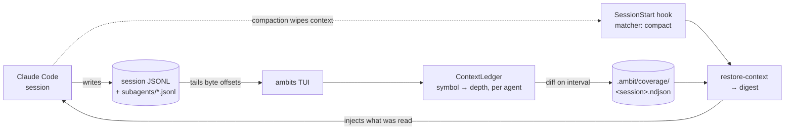
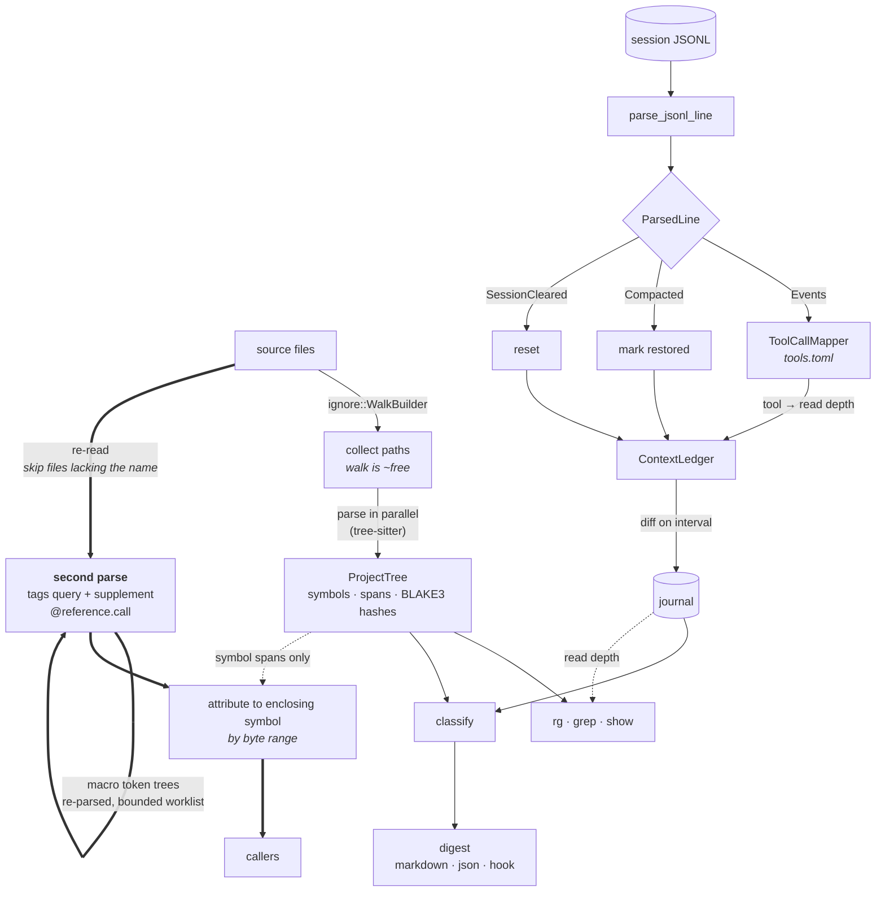

# Architecture

## The memory loop

Claude Code writes a session log as it works. The TUI tails that log, turns
tool calls into per-symbol reads, and diffs them into a durable journal. When a
compaction wipes the context, a `SessionStart` hook reads the journal back and
injects what the session had already read.

The journal is written only by the TUI, which is what removes concurrent-writer
concerns rather than managing them. Everything downstream reads it.

## How a query is served

Two independent pipelines. The **parse** side turns source into a symbol tree;
the **ingest** side turns a session log into per-symbol reads. They meet in
only two places: `classify`, which compares journaled reads against the
current tree, and the coverage annotation on search and `show` results.

Search (`rg`/`grep`) enters the parse side late: it walks and reads every file
but rejects on raw bytes first, parsing only the files that matched — see
[Searching Code](Searching-Code#the-pipeline-runs-backwards).

### `callers` is a separate path

The thick path is `callers`, and it is deliberately separate. A reference
query needs syntax nodes, which the scan discards once it has extracted
symbols — so `callers` re-reads and re-parses, skipping any file whose text
does not contain the name at all. It borrows exactly one thing from the main
pipeline: symbol byte ranges, which is what turns `app.rs:959` into
`src/app.rs::mark_selected_symbols`.

The self-edge is macro handling. tree-sitter does not parse macro bodies —
arguments arrive as an unparsed token tree — so those are re-parsed as source,
and since macros nest it runs as a bounded worklist that feeds itself. Without
it, anything called from inside `println!` or `assert_eq!` is invisible.

### The file watcher and `ProjectScope`

The TUI's file watcher enters this pipeline at `SRC`, and so has to agree with
the walk about what counts as a project file. `ProjectScope` (`src/filter.rs`)
is that shared answer. It is deliberately the narrower of the two — it reads
the root `.gitignore` and `.git/info/exclude`, not `.gitignore` files nested in
subdirectories, which `WalkBuilder` discovers as it descends. The asymmetry
points that way on purpose: too permissive merely admits a file the scan would
have skipped, while too strict would silently stop live updates for a file the
scan included, which is both worse and harder to notice.

## Source map

| Area | Where |
|---|---|
| CLI entry point | `src/main.rs` |
| TUI state and key handling | `src/app.rs`, `src/tui.rs`, `src/ui/` |
| Language parsers | `src/parser/` (`rust.rs`, `python.rs`, `typescript.rs`, `markdown.rs`) |
| Serena backend | `src/serena/` |
| Session ingestion and tool mappings | `src/ingest/` (`claude.rs`, `tool_config.rs`, `default_tools.toml`) |
| Ledger and multi-agent tracking | `src/tracking/` |
| Journal and cache | `src/journal.rs`, `src/cache.rs` |
| `restore-context` and digest | `src/restore.rs`, `src/digest.rs` |
| `rg` / `grep` | `src/search.rs` |
| `show` | `src/lookup.rs` |
| `callers` | `src/callers.rs` |
| Scope and filters | `src/filter.rs` |
| Hook and skill installers | `src/hook.rs`, `src/skill.rs` |

## Design notes

Longer write-ups of individual decisions live in the repository:

- [Compaction awareness](https://github.com/joshLong145/ambits/blob/main/docs/spikes/compaction-awareness.md)
- [Config-driven tool mappings](https://github.com/joshLong145/ambits/blob/main/docs/spikes/config-driven-tool-mappings.md)
- [Grep-style find](https://github.com/joshLong145/ambits/blob/main/docs/spikes/grep-style-find.md)
